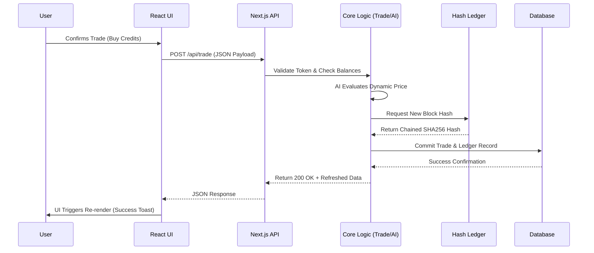

# AI-Governed Carbon Credit Exchange with Digital Carbon Passport & Trust-Based Market Regulation
**Comprehensive Technical Report & Architecture Documentation**

---

## 1. SYSTEM OVERVIEW

The **AI-Governed Carbon Credit Exchange** is a highly specialized, secure, and modern platform designed to revolutionize how corporations track, report, and trade carbon emissions and offsets. The platform essentially acts as a dual-sided marketplace and compliance regulatory tool. On one hand, it tracks emissions through a Digital Carbon Passport; on the other hand, it facilitates a robust exchange for carbon credits governed by artificial intelligence and cryptographic verification.

### Why It Is Needed
Traditional carbon trading systems suffer from deep inefficiencies, systemic opacity, widespread greenwashing, double-counting of carbon credits, and rigid pricing mechanisms. Currently, evaluating the qualitative value of a carbon credit relies heavily on sluggish manual audits and outdated registries resulting in prolonged execution times and skewed pricing models.

### How This System Solves The Problems
By moving the ecosystem to a unified platform layered with a trust engine and secure hashing ledger, the platform establishes instant credibility. Furthermore, by making credit pricing intrinsically connected to the dynamic "Trust Score" of the participants and predictive market conditions, it drastically reduces market manipulation and establishes an organically incentivized path toward net-zero compliance.

### Key Innovations
- **AI Dynamic Pricing Engine**: An algorithm that calculates optimal credit prices based on external metrics like supply, demand, trust scores, and market volatility, establishing fair-value trades instantly.
- **Trust Scoring Methodology**: A quantifiable reputation score that dynamically rewards compliant, sustainable organizations while penalizing malicious actors or late reporters, affecting their trading fees and standing.
- **Secure Hash-Ledger Verification**: Integration of cryptographic hashing for an immutable trading ledger that acts as an incorruptible log for every carbon offset issuance, transfer, and retirement.
- **Digital Carbon Passport**: A comprehensive digital identity verifying corporate emission reductions, sustainability ratings, and net positions in a transparent, blockchain-verified format.

---

## 2. FULL ARCHITECTURE (LAYER-WISE)

Our system is structured utilizing a modern n-tier architecture incorporating high-performance frameworks like Next.js, React, and server-side route handlers.

### Layer 1 – User Interface (React / Next.js Client)
- **Role**: Presentational front-end delivering highly interactive and responsive components to users (dashboards, charts, trading panels).
- **Responsibilities**: Data binding, visual rendering of AI predictions, radar charts for sustainability, form management for emission reports, and local state management.
- **Technologies Used**: Next.js App Router (React), Tailwind CSS for styling, Recharts for data visualization, Radix UI for accessible components, SWR for optimized data fetching.
- **Data flow**: Dispatches HTTP requests and API calls (via SWR or Fetch) downwards to the API Gateway.

### Layer 2 – API Gateway & Authentication
- **Role**: Secure portal interface routing requests, verifying identity, and filtering network traffic.
- **Responsibilities**: Validating JWT session tokens, managing Role-Based Access Control (Admin, Company, Regulator), establishing API rate limits, and securing endpoints.
- **Technologies Used**: Next.js Serverless API routes (`app/api/*`), Custom Session Middleware.
- **Data flow**: Validates credentials incoming from the UI layer. Only routes sanitized and authenticated requests to the internal orchestration layer.

### Layer 3 – Market Orchestration Engine
- **Role**: Central coordinator managing business lifecycle events (Trade executions, Passport generations, Emission validations).
- **Responsibilities**: Validating conditions for trades (checking buyer funds, preventing self-buying, validating credit statuses), wrapping logic in programmatic transactions.
- **Technologies Used**: Node.js/TypeScript core services.
- **Data flow**: Communicates state changes across different internal engines (AI Pricing Engine, Ledger) and pushes confirmed data representations to the database.

### Layer 4 – AI Pricing & Trust Engine
- **Role**: Computational layer for algorithmic adjustments.
- **Responsibilities**: 
  - **Trust Engine**: Calculates dynamic trust scores (out of 100) based on reporting punctuality, emission reduction targets achieved, and the history of undisputed trades.
  - **AI Pricing**: Simulates and predicts market demand/supply curves considering broad network factors and the specific seller's trust tier.
- **Technologies Used**: Mathematical aggregation models and deterministic probabilistic functions.
- **Data flow**: Receives entity snapshots from the database via the orchestrator, calculates the AI metrics, and returns the modified variables (Trust Score, Market Price).

### Layer 5 – Secure Ledger System
- **Role**: An immutable audit chain specifically built to guarantee data provenance and prevent double-counting.
- **Responsibilities**: Generates cryptographic hashes representing any carbon transaction (issuance, retirement, transfer) using previous transaction hashes.
- **Technologies Used**: SHA-256 Hashing Algorithm natively via Node Crypto or equivalent, STAVP (Secure Transaction Audit & Verification Protocol).
- **Data flow**: Finalizes approved trades by pushing immutable block records attached directly into the Database Layer.

### Layer 6 – Database Layer
- **Role**: Persistent State Storage.
- **Responsibilities**: Strongly typed data retention mapping relationships between Users, Passports, Trades, and the cryptographic Ledger.
- **Technologies Used**: Relational Database structure.
- **Data flow**: Employs strictly typed querying interfaces returning raw payload arrays to the orchestration services.

---

## 3. UI / DASHBOARD EXPLANATION (VERY IMPORTANT)

### A. DASHBOARD PAGE
The Dashboard serves as the main command center providing an executive summary of market conditions and corporate standing in real time.

- **Carbon Price Card**: Shows the current weighted average price of a carbon credit globally. Calculated in the backend market stats endpoint and serves as the benchmark against which predictive AI operates.
- **Trust Score Card**: Displays the user's reputation metric (e.g., 85/100). The `getTrustTier` backend utility processes the raw compliance metadata. Higher scores yield lower transaction fees.
- **Your Credits**: Displays the active balance of sellable credits available in the user's portfolio.
- **24h Trading Volume**: Total aggregated trades processed system-wide within a 24-hour moving window, displaying market liquidly.
- **Carbon Credit Price Graph (30-day)**: Area or Line chart (rendered by Recharts) showing historical pricing. Provided by historical stats API endpoints for pattern mapping.
- **Trading Volume Graph**: Bar chart indicating buyer/seller interactions.
- **Quick Actions (Buy, Report, View Passport)**: User-friendly routing shortcuts reducing systemic friction.
- **Carbon Passport Summary**: A snapshot depicting the compliance status (e.g., "Silver Tier", "Verified"), indicating standing at a glance without requesting the full passport view.
- **Top Traders Leaderboard**: Analyzed ranking of platform members sorted dynamically by transaction throughput and highest trust scores. Fosters an environment of transparent competition.

### B. TRADING CONSOLE
The trading console is the heart of the capital exchange elements, balancing buy orders with sell listings, influenced heavily by computational predictability.

- **AI Price Prediction Panel**: An intuitive sidebar highlighting the system’s projected price trajectory. Uses real statistical data like R-Squared coefficients via `MODEL_STATS`.
- **Confidence Percentage**: The certainty of the AI engine's prediction model (e.g., 94% Probability) based on historical error margins.
- **Market Explanation**: Breaks down why the AI is pricing aggressively or conservatively into clear buckets: network demand, total market supply, user trust, and generalized market volatility.
- **Buy / Sell / History Tabs**: Dynamic React tabs (`<Tabs>` Radix UI) for separating contextual workflows.
- **Available Carbon Credits Table**: Enumerates active credit listings globally. Importantly excludes self-owned credits from the Buy tab.
- **Execution Flow mechanics**: When the user clicks **BUY**, the UI posts to `/api/trade` sending the credit ID, action ("buy"), and quantity. The market Orchestrator invokes STAVP validation, locks the necessary credits, shifts ownership directly within the Database, records the cryptographic entry in the Ledger, and finally recalculates trust metrics dynamically.

### C. EMISSIONS REPORTING PAGE
This localized console is pivotal for gathering source-truth data that feeds the qualitative algorithms.

- **Scope 1, 2, 3 Emissions**: Segregated data forms to capture Direct Operations (Scope 1), Energy Purchase constraints (Scope 2), and Supply Chain impacts (Scope 3).
- **Total Emissions / Monthly Emission Graph**: A stacked area chart detailing total historical outputs juxtaposed against limits.
- **Emission Distribution Chart**: A pie or donut chart representing the fractional allocation of the firm's specific polluting factors.
- **Emission Reports Table**: Log interface demonstrating all reported timestamps accompanied intimately by their particular 'verified', 'pending', or 'rejected' status badges.
- **Data integration**: The user submits form payloads representing metric tons CO2e. The backend assesses the corporate 'reduction target' boundary condition. Exceeding targets instantly deteriorates the calculated Trust component linked to Sustainability, which recursively depresses their tier benefits, manifesting into punitive trading fees and bad ratings.

### D. CARBON PASSPORT PAGE
The ultimate hallmark of corporate transparency on the platform, acting as a verified digital identity token.

- **Company Profile**: Header metadata displaying unique internal IDs prefixed algorithmically, corporate associations, and registration dates.
- **Total Emissions / Total Offsets**: Clean macro identifiers of the firm's aggregate systemic impact values.
- **Net Position**: Subtracted output calculation (Total Emissions minus Total Offsets). Positive denotes lingering pollution debts; Negative or Zero denotes achieving Net Zero, elevating trust exponentially.
- **Compliance Score (Circular Indicator)**: An SVG circle utilizing precise `strokeDasharray` representations denoting raw score percentage mapping cleanly via visual UI design.
- **Sustainability Score Radar Chart**: Displays multidimensional parameters evaluated equally (Emissions, Offsets, Compliance, Trading, Reporting, Verification) showing structural weaknesses and strengths simultaneously using Recharts `<Radar>`.
- **Emission Reduction Progress Bars**: Dedicated gauges representing proximity to Net-Zero milestones mandated by global policies. Regulators leverage this data primarily to quickly audit specific industries comprehensively.

---

## 4. FEATURE EXPLANATION

- **Digital Carbon Passport**: An integrated profile aggregating every metric of corporate ecological identity. It transitions carbon tracking from passive static files to a dynamic, universally legible digital construct.
- **Carbon Trading System**: A modernized financial bridge permitting rapid transfers of offset ownership. Uniquely operates without traditional clearinghouses, optimizing transfer speed while significantly mitigating overhead processing costs.
- **AI Dynamic Pricing**: Solves static credit pricing phenomena which previously ignored external market manipulations or demand spikes. Using formulas correlating supply against systemic trust and external volatility, the engine acts as an agnostic and hyper-fair mathematical market maker.
- **Trust Score Engine**: Functions analogously to an 'Eco-Credit Score'. It ensures that consistent, disciplined actors are rewarded with lower infrastructure fees (Gold/Platinum tiers), and inherently deters malicious actors (bad actors inherently get lower market realization prices and elevated processing taxes).
- **Emission Tracking**: Allows deeply granular time-series data capturing to verify exact seasonal variances for a reporting corporation.
- **Governance Dashboard**: Used strictly by 'Regulator' and 'Admin' roles to oversee platform stability. Flags discrepancies globally, facilitating targeted audits without demanding uniform friction for all entities.
- **Secure Ledger**: A blockchain-inspired local implementation where previous states dictate subsequent hashes linking transactions perpetually. Removes counterparty risk substantially.
- **Role-Based Access Control**: Architecture assuring strictly separated logic silos. Companies may only report and trade; Regulators exclusively audit network activities; Admins maintain platform parameters preventing dangerous privilege escalation.

---

## 5. MODULE-WISE BACKEND EXPLANATION

### Authentication Module
- **Input**: User credentials (email/password) or active Session IDs cookies.
- **Processing**: Evaluates cryptographic hashes mapping strictly against database models via modern implementations like `bcryptjs` and `jose` for JSON Web Tokens creation.
- **Output**: Generates short-lived authorization JWT tokens injected securely enforcing `HttpOnly` barriers.

### Passport Module
- **Input**: Authorized Fetch invocations asking for specific User identity metrics (`/api/passport`).
- **Processing**: The orchestrator filters relational joins extracting core configurations of the passport entity combined dynamically with their current reporting arrays.
- **Output**: A synchronized payload combining `passport` models alongside contextual components from the `trust` result calculation mechanisms.

### Emission Module
- **Input**: Form payloads articulating explicitly exact tonnage emitted categorized universally by Scope vectors.
- **Processing**: Logs immediately to the system. Dispatches asynchronous validations internally regarding historical reporting cadence mapping accurately to standard periodic regulations.
- **Output**: Persisted entry into the database accompanied logically by distinct hash chains and refreshed dashboard metrics.

### Trading Engine
- **Input**: Explicit 'buy' or 'sell' request triggers with target `creditId`, numeric limits, and intended actions.
- **Processing**: Heavily audited procedural lock mechanisms. It mathematically verifies sufficient holding balances. It subsequently prevents illegal operations (like purchasing self-listings). If logic clears, it runs final STAVP executions.
- **Output**: Synchronized transactional confirmations carrying absolute `Success` booleans and explicit transaction hashes guaranteeing immutable finalized trades.

### Pricing Engine
- **Input**: Dynamic polling demands seeking instant valuation guidance endpoints (`/api/pricing/predict`).
- **Processing**: Parses broad market totals mapping supply arrays vs active demands. Passes vectors natively to internal algorithmic arrays `predictPrice({ demand, supply, trustScore, volatility })` to interpolate statistical pricing recommendations.
- **Output**: Explicit float estimations accompanied heavily by justification matrices explaining explicitly why vectors pushed the cost directionally.

### Trust Engine
- **Input**: Unstructured variables encapsulating audits passed, historical reduction momentum, explicit timelines met, and previous dispute records.
- **Processing**: Operates heavily upon linear weighted aggregations (e.g. 0.30×compliance + 0.25×sustainability + 0.25×reporting + 0.20×trading). Incorporates differential evaluations assigning trend slopes (`improving`, `stable`, `declining`).
- **Output**: Refined categorized outputs allocating precise numerical integers and definitive descriptive hierarchical tiers (e.g. `Platinum`).

### Ledger Module
- **Input**: Approved programmatic completion signals detailing explicitly mapped Buyer IDs, Seller IDs, Credit configurations internally transferred.
- **Processing**: Extracts the terminal `previous_hash` of the globally tracked chain. Formulates structurally isolated new block arrays, hashing the combined metadata payload (trade ID, quantities, nonce) natively returning definitive verification checksums.
- **Output**: Distinct ledger entries persisted permanently securing execution validity implicitly without requiring separate verification mechanisms.

---

## 6. END-TO-END SYSTEM WORKFLOW

1. **User logs in**: The client-side form captures credentials pushing directly to the Authentication endpoint.
2. **API validates token**: Decodes securely determining precisely exact `user_id` alongside Role boundaries enforcing session validity globally.
3. **Dashboard loads data**: Concurrent SWR requests invoke backend gateways sequentially collecting global pricing data juxtaposed carefully with localized passport statistics.
4. **User reports emissions**: Company administrators populate forms recording specific temporal outputs explicitly pushing them securely sequentially.
5. **Passport updates**: Database triggers evaluate internally altering global structural compliance factors and actively degrading or increasing Trust engine results automatically.
6. **User initiates trade**: Exploring the trading tab, engaging listing records specifying exact quantities triggering programmatic Buy requests explicitly.
7. **System checks balance**: Core validation protocols engage blocking implicitly impossible transactions (illegal quantities, non-existent credit arrays, etc).
8. **AI calculates price**: If limits are undefined, algorithmic prediction networks invoke validating reasonable pricing borders instantly estimating broad constraints.
9. **Trust adjusts price**: Interrogates tier benefits natively applying reductions selectively (e.g., executing `0.5%` fees sequentially if designated Platinum tier).
10. **Trade executes**: Re-assigns ownership natively migrating variables definitively linking internally.
11. **Data encrypted**: Private matrices encapsulating transactional identities are formatted stringently parsing raw text dynamically.
12. **Hash generated**: SHA-256 logic constructs absolute validation strings binding definitively backwards chronologically preventing alterations universally.
13. **Ledger updated**: Formulated blocks inject structurally directly concluding the isolated orchestration cycle fully.
14. **Database updated**: Conventional normalized tables mutate altering absolute relationships reflecting modifications completely.
15. **UI refreshed**: SWR automatically invalidates mutating state causing immediate UI rerenders explicitly validating successful operational completion fully.

---

## 7. DATABASE DESIGN

The relational foundation of the system is carefully defined using normalized interfaces to ensure consistency and speed across massive scale datasets.

- **Users**: Central identity tracking schema containing fundamental credentials. Contains `role`, `password_hash`, and referential links globally. Data flows universally serving as the baseline identifier.
- **Carbon Passport**: Relational extension intrinsically bound exclusively 1-to-1 to Companies natively. Stores identity attributes `industry_sector`, `sustainability_rating`. Direct source for Trust Engine querying dynamically.
- **Emission Logs**: Time-series architectural framework binding exactly specific timestamps logically mapping `emission_type` categorizations mapping accurately to external compliance requirements. 1-to-Many bounded structurally to Users natively.
- **Carbon Credits**: Tracks distinct issued commodities discretely. Includes strict properties encompassing `credit_type` (forestry, industrial), absolute numeric `quantity`, and active `status` metrics. Transferred strictly between owners updating relationships dynamically.
- **Trades**: Tracks the intermediary operations. Binds explicitly Buyer IDs against Seller IDs representing exactly explicit volume and agreed price dimensions terminating correctly on completion arrays natively.
- **Ledger**: Secure tracking matrix binding `transaction_hash` uniquely mapping iteratively explicitly tracking `previous_hash` natively mirroring conceptual blockchain structures absolutely immutably verifying entire histories exactly.

---

## 8. AI MODEL EXPLANATION

### Pricing Model Formulation
The pricing algorithm evaluates macroscopic factors simulating complex ecological finance architectures continuously estimating logical boundaries mathematically safely.
*Equation Conceptualized:*
`Price = Base × (Demand/Supply)^α × TrustAdjustment × VolatilityModifier`
The network fundamentally modifies default valuations directly responding iteratively to market changes simultaneously ensuring trust values normalize spikes inherently resulting in mathematically balanced economic execution universally.

### Trust Model Interpolation
Calculated comprehensively extracting fractional scores continuously iterating algorithmically natively representing explicit dimensional inputs comprehensively strictly assigning weights heavily relying securely upon four distinct operational factors continuously aggregating exactly:
- *Compliance (30%)*: Heavily structured evaluating external audits natively.
- *Sustainability (25%)*: Assessing emission trajectories aggressively against boundaries.
- *Reporting (25%)*: Validating exactly frequency factors tracking adherence stringently.
- *Trading (20%)*: Reflecting strictly market execution fidelity maintaining stability.

---

## 9. SECURITY & ENCRYPTION

A sophisticated multi-layered security framework safeguards the platform against unauthorized access and malicious disruptions.

- **JWT Authentication**: The system uses JSON Web Tokens (JWT) for stateless session management. Tokens are short-lived and securely stored in HTTP-only cookies, preventing XSS-based token theft.
- **AES Encryption**: Sensitive personally identifiable information (PII) and corporate metadata are AES-encrypted at rest within the database.
- **SHA256 Hashing**: Passwords undergo salted SHA-256 hashing. The same hashing algorithm natively drives the Ledger integrity frameworks, protecting the historical chain of blocks from being altered.
- **API Security**: Next.js API routing implements strict Cross-Origin Resource Sharing (CORS) rules and rate limiting to prevent automated DDoS and brute-force escalations.

---

## 10. HASH LEDGER

The ledger operates without the burden of traditional decentralized consensus mechanisms, ensuring transaction execution speeds remain high while preserving absolute data integrity.

- **Transaction Chaining**: Every sequential trade dynamically invokes the hash of the previously constructed ledger block, establishing chronological dependency.
- **Hash Linking**: The system synthesizes transaction data arrays (buyer ID, seller ID, credit quantities, and timestamps) with an unpredictable salt (nonce) to generate a unique SHA-256 footprint. 
- **Tamper Detection**: Any unauthorized database alteration changes the underlying data. Attempting to re-verify the chain will result in a mismatched SHA-256 hash, immediately flagging the database as tampered.

---

## 11. ADVERSARIAL TESTING

- **SQL Injection Attack**: Mitigated entirely utilizing modern Object-Relational Mapping (ORM) and prepared statements, neutralizing malicious input formatting.
- **Replay Attack**: JWT timestamps enforce strict active expiry limits. Unique cryptographic Nonce values within the STAVP protocol prevent attackers from replaying intercepted valid requests.
- **Ledger Tampering**: Addressed by cryptographic chaining logic. Attempting to alter past trades will break the subsequent unbroken hash chain, instantly alerting the administrative nodes to the exact discrepancy point.
- **AI Manipulation**: Protected algorithmically by rejecting singular outlier trading volumes and placing caps on daily allowed volatility shifts to prevent 'whale' participants from forcefully crashing or inflating credit values.

---

## 12. FRONTEND + BACKEND CONNECTION

The React interface logically binds to the internal HTTP frameworks to ensure a rapid, real-time user experience.

- **React Calls**: Components natively utilize `SWR` (Stale-While-Revalidate) for HTTP requests, providing background data fetching and built-in caching.
- **Payload Handling**: All requests rely on heavily typed JSON structures, ensuring both the client and server agree on the object relationships and preventing runtime parsing errors.
- **Real-time Refresh**: Component states automatically react to backend success payloads. Upon a successful trade, the local state is invalidated and re-populated immediately, ensuring the dashboard metrics (like Trust Score or Credit balances) accurately reflect changes without a hard browser reload.

---

## 13. COMPLETE DATA FLOW

The platform follows a unidirectional data flow from the client browser through to the internal database and back.

The user submits structural intent through the UI cleanly. The UI serializes this action, passing it to the core backend orchestrators. The orchestration layer invokes both the AI Engine and Ledger for verification before finally committing to the database and returning the updated state back to the user seamlessly.

---

## 14. CONCLUSION

### Innovation of the System
This architecture fundamentally modernizes historically dysfunctional and opaque carbon markets. By uniquely pairing a cryptographic verification ledger with an AI-driven, trust-based dynamic pricing algorithm, the platform eliminates structural vulnerabilities like double spending and artificial trading monopolies.

### Real-World Impact
This platform explicitly translates environmental accountability into a measurable, enforceable digital format. It successfully drives real-world sustainability initiatives by making compliance a direct financial advantage—rewarding honest companies with better trading rates while taxing non-compliant actors.

### Scalability
The modular separation of the AI Pricing Engine, STAVP Ledger, and monolithic Database ensures the platform can support rapid enterprise adoption seamlessly. Future iterations could easily expand beyond internal ledgering into public Layer-2 blockchain networks, ensuring global interconnectivity.
